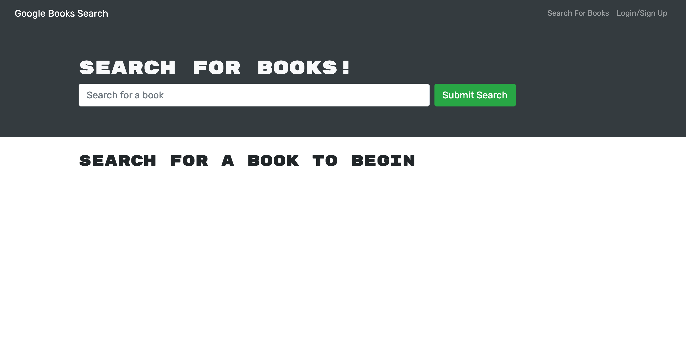

# book-search-engine

# Website Link
[Website Link](https://safe-eyrie-09460.herokuapp.com/)

# Preview

# Table Of Contents

* [Description](#description)
* [Built With](#built-with)
* [Installation](#installation)
* [User's Guide](#users-guide)
* [Testing](#testing)

# Description
A book search engine that allows a user to search for books and save them for later viewing.  Built with a mongoDB database a React.js.

# Built With
- HTML
- CSS
- Bootstrap
- Javascript
- React.js
- Express.js
- MongoDB
- Mongoose
- GraphQL
- Bcrypt

# Installation
1. Clone the repository.
2. Run `npm install` in the command line to install the dependancies.
3. Run `npm start` in the command line to start the program.

# User's Guide
As mentioned in the [Installation](#installation) instructions, run `npm start` to start the program or navigate to the [Website Link](#website-link).  From website the user will be directed to the homepage where they can search for a book or login/sign-up.  Logged in users may save books or removed saved books from their saved list.  Users may view their list of saved books by clicking on the `Saved Books` tab in the navigation bar at the top of the page.

# Testing
Follow the [Installation](#installation) instructions to perform manual testing.
